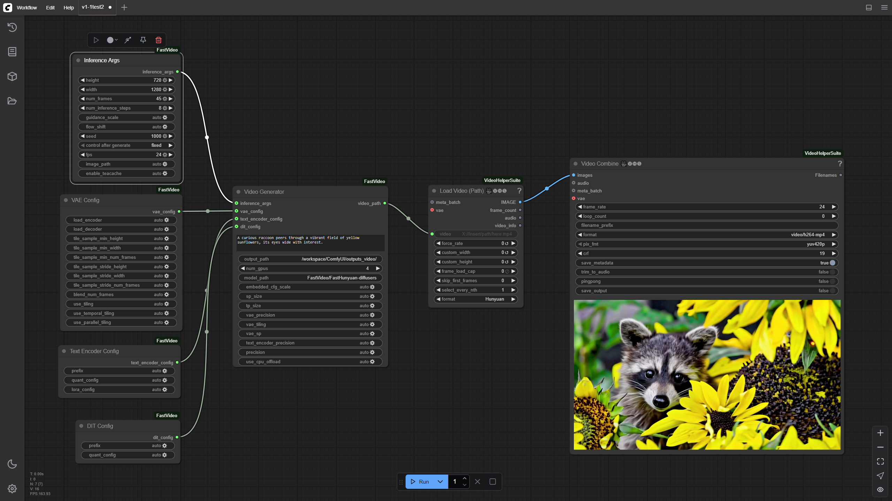
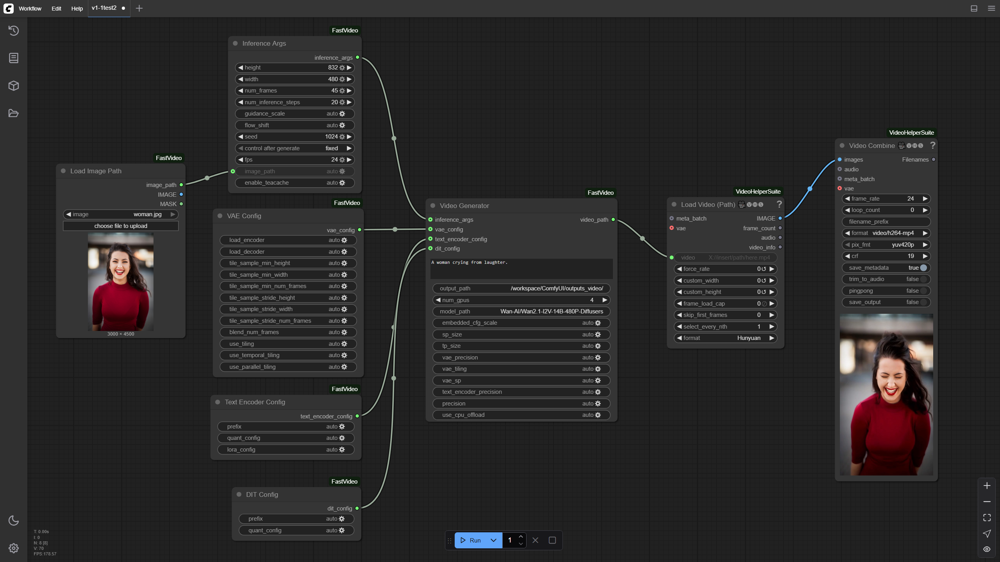

# ComfyUI-FastVideo

A custom node suite for ComfyUI that provides fast video generation capabilities using [FastVideo](https://github.com/hao-ai-labs/FastVideo).

## Multi-GPU Parallel Inference

One of the key feature ComfyUI-FastVideo brings to ComfyUI is its ability to distribute the generation workload across multiple GPUs, resulting in significantly faster inference times.


## Features

- Generate high-quality videos from text prompts and images
- Configurable video parameters (prompt, resolution, frame count, FPS)
- Support for multiple GPUs with tensor and sequence parallelism
- Advanced configuration options for VAE, Text Encoder, and DIT components
- Interruption/cancellation support for long-running generations

## Installation

### Requirements

- [ComfyUI](https://github.com/comfyanonymous/ComfyUI)
- CUDA-capable GPU(s) with sufficient VRAM

### Install using ComfyUI Manager

Coming soon!

### Manual Installation

1. Clone this repository into your ComfyUI custom_nodes directory:

```bash
cd /path/to/ComfyUI/custom_nodes
git clone https://github.com/kevin314/ComfyUI-FastVideo
```

2. Install dependencies:

Currently, the only dependency is `fastvideo`, which can be installed using pip.

```bash
cd /path/to/ComfyUI/custom_nodes/ComfyUI-FastVideo
pip install -r requirements.txt
```

3. Install missing custom nodes:

ComfyUI-VideoHelperSuite

```bash
cd /path/to/ComfyUI/custom_nodes
git clone https://github.com/Kosinkadink/ComfyUI-VideoHelperSuite.git
```

### Model Installation

model_path takes either a model id from huggingface or a local path to a model.

## Usage

After installation, the following nodes will be available in the ComfyUI interface under the "fastvideo" category:

- **Video Generator**: The main node for generating videos from prompts
- **Inference Args**: Configure video generation parameters
- **VAE Config**
- **Text Encoder Config**
- **DIT Config**
- **Load Image Path**: Load images for potential conditioning

### Node Configuration

#### Video Generator

- **prompt**: Text description of the video to generate
- **output_path**: Directory where generated videos will be saved
- **num_gpus**: Number of GPUs to use for generation
- **model_path**: Path to the FastVideo model
- **embedded_cfg_scale**: Classifier-free guidance scale
- **sp_size**: Sequence parallelism size (usually should match num_gpus)
- **tp_size**: Tensor parallelism size (usually should match num_gpus)
- **precision**: Model precision (fp16 or bf16)

#### Inference Args

- **height/width**: Resolution of the output video
- **num_frames**: Number of frames to generate
- **num_inference_steps**: Number of diffusion steps per frame
- **guidance_scale**: Classifier-free guidance scale
- **flow_shift**: Frame flow shift parameter
- **seed**: Random seed for reproducible generation
- **fps**: Frames per second of the output video
- **image_path**: Optional path to input image for conditioning (for i2v models)

## Example workflows

### Text to Video

FastVideo-FastHunyuan-diffusers



### Image to Video

Wan2.1-I2V-14B-480P-Diffusers




## License

This project is licensed under Apache 2.0.